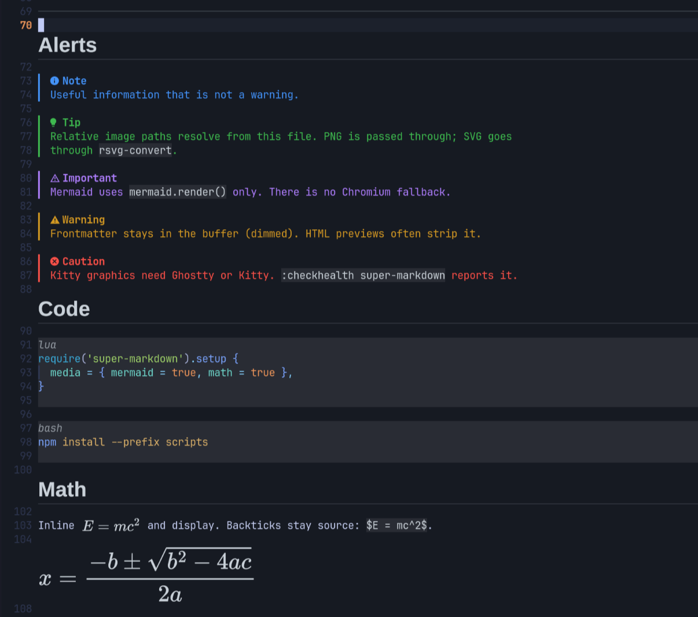
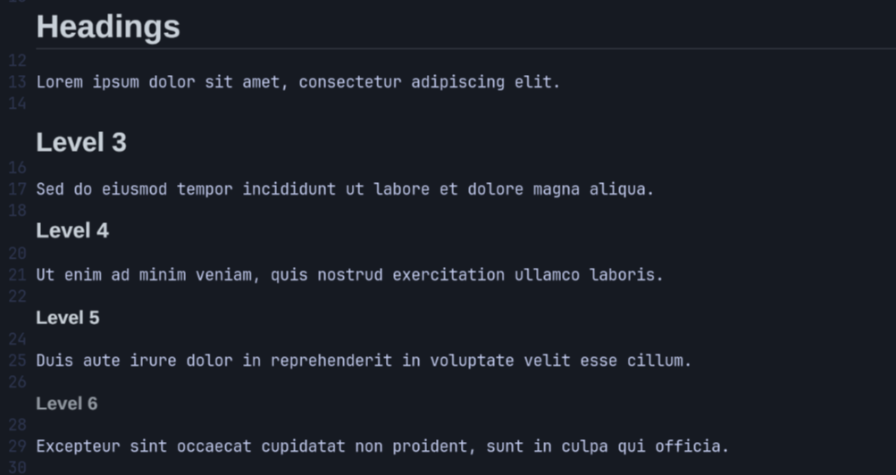
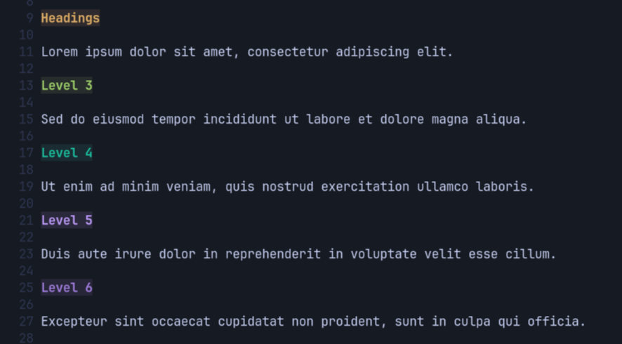
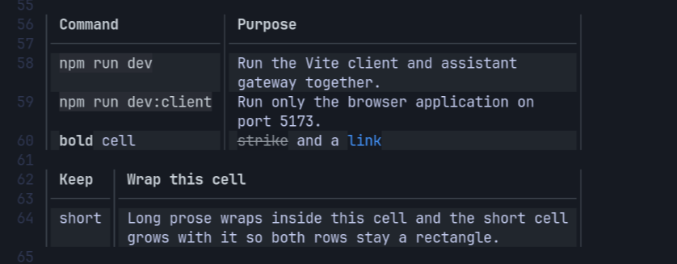
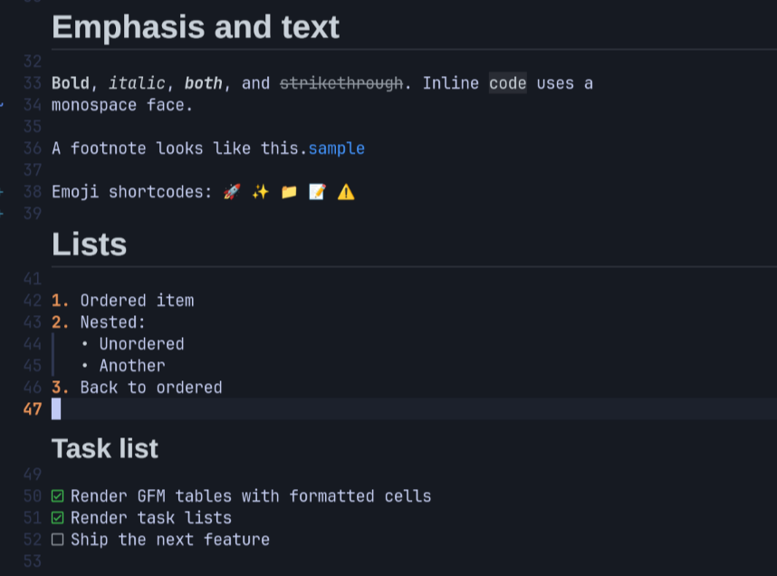
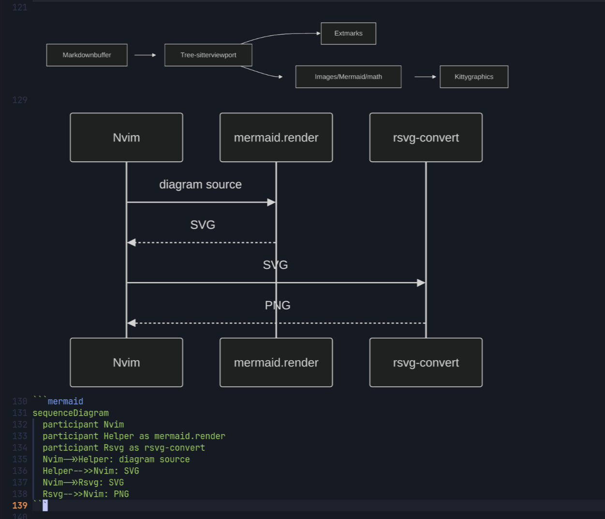
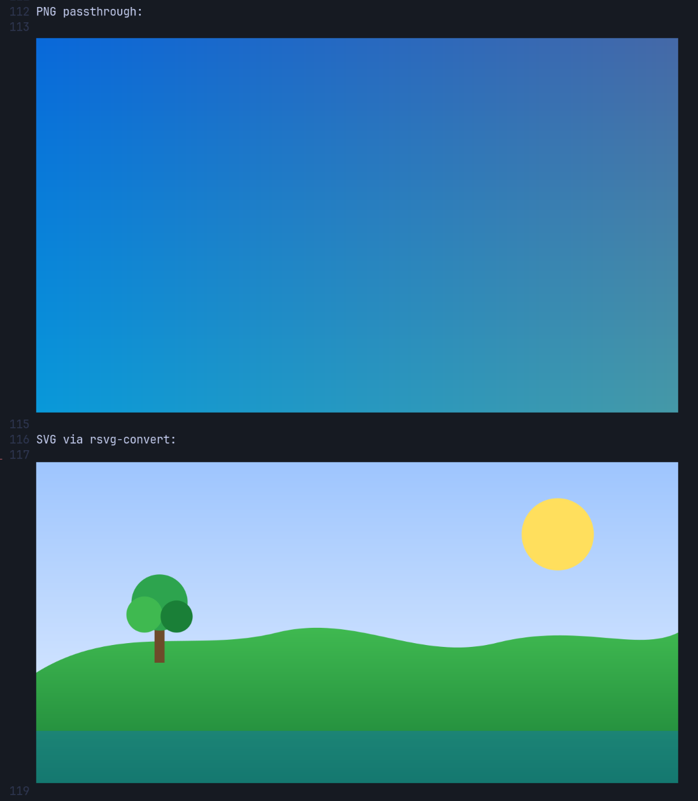
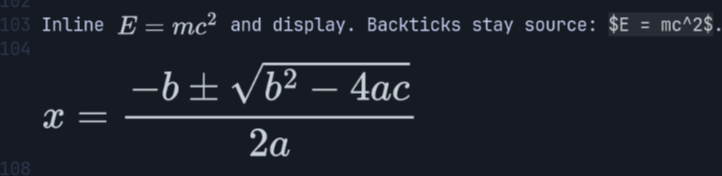

# super-markdown.nvim

Inline GitHub-Flavored Markdown rendering for Neovim.



- Graphically-rendered headings, images, mermaid diagrams and math using Kitty Graphics Protocol
- GitHub-style checklists, alerts, rendered tables and more
- Fully-configurable - enable/disable rendering by element type

>[!WARNING]
>
> This is an experimental work-in-progress that uses Kitty Graphics Protocol heavily.

## Requirements

- Neovim `>= 0.11` (developed on 0.12)
- Tree-sitter parsers `markdown` and `markdown_inline`
- Ghostty or Kitty for inline images
- [`rsvg-convert`](https://gitlab.gnome.org/GNOME/librsvg) for SVG / Mermaid / math
- Node.js, then `npm install` in `scripts/` for Mermaid (and math)
- ImageMagick `magick` only for JPEG/GIF/WebP

### A note about tmux, Zellij, herdr, etc.

If you use a multiplexer, it must also support Kitty graphics.

## Features

### Headings

Graphically-rendered headings:


#### Simple Headings

Headings can also be rendered non-graphically wth standard syntax highlighting colors
using the `simple` flag in config (see below):



### Tables

Text in table cells is wrapped and supports markdown formatting:



### Text Effects



### Mermaid



### Images



### Math



## Install

lazy.nvim:

```lua
{
  'keathmilligan/super-markdown.nvim',
  ft = 'markdown',
  opts = {},
  build = 'npm install --prefix scripts',
}
```

After clone, install helpers:

```sh
npm install --prefix scripts
```

## Commands

| Command | Action |
| --- | --- |
| `:SuperMarkdown` / `:SuperMarkdown toggle` | Toggle globally |
| `:SuperMarkdown enable` / `disable` | Global on/off |
| `:SuperMarkdown buf_toggle` | Toggle current buffer |
| `:SuperMarkdown buf_enable` / `buf_disable` | Buffer-local |

`:checkhealth super-markdown` reports parsers, terminal graphics, `rsvg-convert`, Node, and helpers.

Open [`samples/showcase.md`](samples/showcase.md) to exercise headings, alerts,
tables, images, Mermaid, and math in one buffer.

## Appearance

Markdown **elements** use GitHub light/dark tokens (headings, alerts,
quotes, tables, code frames, links). `Normal` stays on your colorscheme. Fenced
code **syntax** stays with Tree-sitter / the editor highlighter.

GitHub alerts (`> [!NOTE]`, `[!TIP]`, `[!IMPORTANT]`, `[!WARNING]`, `[!CAUTION]`)
use GitHub’s titles and colors.

Mermaid is `mermaid.render()` → SVG → `rsvg-convert`. On failure the plugin
logs an error and leaves the fence as source. There is no Chromium fallback.

Math (`$…$`, `$$…$$`) is TeX → SVG (MathJax lite adaptor; KaTeX has no SVG
backend without a browser). Skip if the helper is not installed.

While editing an image's source line in Insert mode, its current preview is
kept until you leave the line or exit Insert mode. New images render then too.

## Configuration

Each render feature is a nested section with `enabled` (default on). Width
and height values `0–1` are a window fraction; `>1` are columns or cells.

```lua
require('super-markdown').setup {
  debounce_ms = { insert = 120, normal = 40 },
  max_bytes = 1024 * 1024,
  heading = {
    enabled = true,
    -- Conceal `#` / setext underline; bold colorscheme title; no graphic.
    simple = false,
  },
  code = { enabled = true },
  quote = { enabled = true },
  alert = { enabled = true },
  list = { enabled = true },
  checkbox = { enabled = true },
  table = {
    enabled = true,
    max_width = 1,
  },
  hr = { enabled = true },
  frontmatter = { enabled = true },
  link = { enabled = true },
  codespan = { enabled = true },
  strike = { enabled = true },
  emphasis = { enabled = true },
  emoji = { enabled = true },
  footnote = { enabled = true },
  media = {
    enabled = true,
    image = true,
    mermaid = true,
    math = true,
    -- Cap for standalone images; mermaid renders at this width.
    max_width = 1,
    -- Cap for images. 1 = window height. Images that already fit are
    -- not upscaled; taller ones keep aspect ratio and may be narrower.
    max_height = 1,
  },
}
```

`heading.enabled = false` skips heading chrome and heading graphics.
`heading.simple = true` (with `enabled = true`) keeps the title as bold
text in the colorscheme / Tree-sitter heading color. `media.enabled` is
the master switch for images, mermaid, math, and heading graphics.
