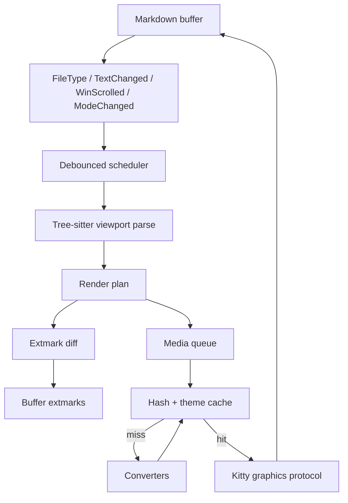
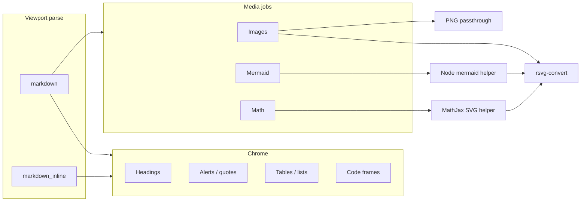

# Design: GFM inline markdown rendering

| Created | Updated |
| --- | --- |
| 2026-09-09 | 2026-09-09 |

## Approach

One Neovim plugin renders GFM in the source buffer. Tree-sitter describes the
visible range; Lua applies extmarks for document chrome and the Kitty graphics
protocol for images, Mermaid, and math. Visual tokens are copied from
gfm-hotview, not from render-markdown’s rainbow headings or from snacks’
kitchen-sink image module.

The editor remains the editor: `gfm-hotview` is still the place to get a
browser-faithful page. This plugin’s job is to make the buffer *read* like
that page without leaving Neovim and without paying startup or Chromium costs
on every keystroke.

## Current setup

The user’s config loads two plugins for markdown:

| Plugin | What it actually does here | Cost |
| --- | --- | --- |
| `render-markdown.nvim` | Default opts, `ft = markdown`. Headings, code, tables, callouts, checkboxes via extmarks. | Tree-sitter walk, namespace clear/rebuild, `CursorMoved` anti-conceal, `nvim-web-devicons` |
| `snacks.nvim` | `lazy = false`, **only** `image` enabled, math off. Inline images + Mermaid. | Entire snacks tree at startup; ImageMagick; `mmdc` + Chromium per diagram |

They run independently: two parsers, two mark namespaces, no shared cache.
Mermaid uses `mmdc` with `mermaid-puppeteer.json` pointing at `/usr/bin/chromium`.
The terminal is Ghostty (`TERM_PROGRAM=ghostty`), which supports the Kitty
graphics protocol with unicode placeholders. Neovim is 0.12.5.
`rsvg-convert` and `magick` are installed; a standalone `resvg` binary is not.

## Why the current stack is heavy

**snacks is the wrong unit of reuse.** The image module is small relative to
the plugin. Loading snacks at startup pulls picker, dashboard, notifier, and
the rest for one feature.

**Conversion process model.** snacks treats each image or diagram as a
one-shot job. PNG still goes through identify/magick. SVG is rasterized with
ImageMagick at density 192. Mermaid starts mermaid-cli, which starts
Puppeteer, which starts Chromium. That is the dominant hitch when a note with
diagrams opens.

**Two render loops.** render-markdown already viewport-culls, but on a buffer
change it clears its namespace and rebuilds every mark. `CursorMoved` walks
all marks to hide the cursor line. snacks walks Tree-sitter again for image
nodes. A combined plugin can do one walk and one mark set.

**Visual mismatch.** render-markdown’s default heading icons and per-level
backgrounds do not resemble gfm-hotview (GitHub-like weight, muted h6, border
under h1/h2). Callouts are generic; gfm-hotview implements GitHub alerts with
specific colors and titles.

## Alternative rendering methods

These were considered. Only the first plus Kitty graphics is in scope.

| Method | Verdict |
| --- | --- |
| In-buffer extmarks + conceal | **Chosen for chrome.** The only way to keep editing the source. Neovim cannot grow heading font size; we approximate with weight, color, and underlines. |
| Kitty graphics protocol | **Chosen for media.** Known to work on Ghostty. WezTerm lacks inline placeholders; Zellij cannot pass through. |
| Browser / webview preview | Rejected. That is gfm-hotview. A second Chrome is the opposite of lighter. |
| Separate “rendered” buffer (glow-style) | Rejected. Splits source from view; worse for editing. |
| Rasterize the whole page to an image | Rejected. Uneditable and slower than Mermaid-via-Chromium. |
| Tree-sitter highlights only | Rejected. No tables, alerts, images, or diagrams. |
| Sixel / chafa half-blocks | Fallback only if graphics protocol is missing; quality is too far from gfm-hotview to be the default. |

Mermaid-specific options:

| Method | Verdict |
| --- | --- |
| `mmdc` + Chromium per diagram (today) | Rejected. Too slow and too much RAM. |
| Long-lived Chromium worker | Rejected. No Chromium fallback. |
| mermaid.js `render()` → SVG → `rsvg-convert` | **Chosen.** Same library gfm-hotview vendors. `htmlLabels: false` so labels stay SVG. Theme `default` / `dark` to match gfm-hotview, not snacks’ `neutral`. On failure, log an error and leave the fence as source. |
| Kroki / mermaid.ink | Rejected. Network, not offline. |
| ASCII/unicode diagrams | Rejected. Does not match gfm-hotview. |

Math-specific options:

| Method | Verdict |
| --- | --- |
| LaTeX / tectonic / typst (snacks) | Rejected. User already disabled it. |
| `pylatexenc` / unicode (render-markdown) | Rejected. Does not look like KaTeX. |
| KaTeX HTML/MathML | Rejected for inline images: KaTeX has no SVG backend without a browser. |
| MathJax liteAdaptor TeX → SVG → `rsvg-convert` | **Chosen.** Known-working offline SVG path. Skip when the helper is absent. |

Image rasterization:

| Method | Verdict |
| --- | --- |
| ImageMagick for everything | Rejected as the default. |
| PNG bytes sent as-is | **Chosen.** Kitty accepts PNG. |
| `rsvg-convert` for SVG | **Chosen.** Installed on this machine; much smaller than magick for vectors. |
| magick | Optional fallback for JPEG/WebP/GIF if a native decode is not worth shipping. |

## Architecture

One attach per markdown buffer. The scheduler never does work on
`CursorMoved` except a two-line anti-conceal toggle.



The parse step emits a typed plan, not plugin-specific mark tables. Chrome
handlers and media handlers share that plan so a ` ```mermaid ` fence is one
node: conceal the fence, enqueue a diagram, reserve placeholder rows.



### Module layout

```
lua/super-markdown/
  init.lua          -- setup, public API
  config.lua
  health.lua
  style.lua         -- palettes + highlight groups
  attach.lua        -- autocmds, debounce
  parse.lua         -- one Tree-sitter walk → plan
  apply.lua         -- extmark diff/reuse
  conceal.lua       -- cursor-line toggle
  media/
    protocol.lua    -- Kitty APC + Ghostty placeholders
    cache.lua
    path.lua
    image.lua
    mermaid.lua
    math.lua
```

No `nvim-web-devicons`. Language labels on code blocks use a small built-in
map of nerd-font glyphs (the user already sets `vim.g.have_nerd_font = true`).
Tree-sitter parsers `markdown` and `markdown_inline` are required; the
`nvim-treesitter` *plugin* is not, on Neovim 0.12.

### Scheduler rules

- Debounce insert-mode text changes (~120ms). Normal-mode `TextChanged` can
  be shorter.
- `WinScrolled` only reparses when the visible line range leaves the last
  parsed overscan.
- `ModeChanged` switches rendered vs raw (insert can keep rendering; raw on
  the cursor line is handled by anti-conceal).
- Do not hook `CursorMoved` for parse. Index virt-text marks by line; on
  cursor move, hide marks on the new line and restore the previous line.
- Prefer `conceal` for `#` markers, list markers, checkbox brackets, and
  link syntax so Vim’s own cursor-line reveal does the cheap part.
- Files larger than a configurable byte/line cap attach but do not render.

### Extmark reuse

render-markdown’s update path clears the namespace and recreates marks. That
is simple and jittery. This plugin assigns stable ids from `(kind, start_row,
start_col)` and calls `nvim_buf_set_extmark` in place. Marks whose plan
entry disappeared are deleted. Unchanged ranges are left alone.

### Media cache

Key: `sha256(kind + theme + source bytes or resolved path mtime/size)`.
Store under `stdpath('cache')/super-markdown/`. PNG results are what the
protocol sends. A cache hit must not spawn Node, rsvg, or magick.

Jobs whose source range leaves the viewport are cancelled. Scrolling back
reuses the cache.

## Appearance contract

Source of truth: `gfm-hotview/web/assets/app.css` (`:root` / `html[data-theme="dark"]`)
and `markdown.css`. Terminal approximations cannot match `font-size: 2em`;
they must match color, weight, borders, and structure.

### Tokens

| Token | Light | Dark |
| --- | --- | --- |
| `--gv-bg` | `#ffffff` | `#0d1117` |
| `--gv-fg` | `#1f2328` | `#c9d1d9` |
| `--gv-muted` | `#59636e` | `#9198a1` |
| `--gv-border` | `#d1d9e0` | `#3d444d` |
| `--gv-pre-bg` | `#f6f8fa` | `#151b22` |
| `--gv-accent` | `#0969da` | `#4493f8` |

Alert title/border colors (light / dark):

| Type | Light | Dark |
| --- | --- | --- |
| NOTE | `#0969da` | `#4493f8` |
| TIP | `#1a7f37` | `#3fb950` |
| IMPORTANT | `#8250df` | `#ab7df8` |
| WARNING | `#9a6700` | `#d29922` |
| CAUTION | `#cf222e` | `#f85149` |

Titles: Note, Tip, Important, Warning, Caution — same as gfm-hotview, not
the raw `[!NOTE]` marker.

### Element mapping

| gfm-hotview | In-buffer rendering |
| --- | --- |
| h1/h2 with bottom border | Conceal `#`, bold fg, underline or a virt-line of border color |
| h3–h5 weight 600 | Conceal `#`, bold; no rainbow backgrounds |
| h6 muted | Muted fg |
| Links | Accent; conceal destination when the label is shown |
| Blockquote | Muted fg + left border virt-text in `--gv-border` |
| Alerts | Left border + title in the alert color; nerd-font stand-in for octicons |
| Inline code | `--gv-fg` at 8% onto transparent as background (or `--gv-pre-bg`) |
| Fenced code | Line background `--gv-pre-bg`; language label; **editor** Tree-sitter colors inside |
| Tables | Box-drawing in `--gv-border`; striped rows use a lighter lift, not sidebar-bg |
| Task lists | Concealed `[ ]` / `[x]` with checkbox glyphs |
| `---` | Full-width rule in `--gv-border` |
| `~~strike~~` | Strikethrough highlight |
| `:rocket:` | Virt-text / conceal to Unicode |
| Footnotes | Compact marker; definition block at the bottom stays in the buffer |
| Images | Scaled to window width (gfm `max-width: 100%`) |
| Mermaid | Converted diagram, transparent page, theme `default` or `dark` |
| Math | TeX → SVG image (MathJax lite adaptor) |
| Frontmatter | Dimmed, still editable (gfm-hotview strips it for HTML; the editor must not) |

`Normal` for the buffer stays on the active colorscheme (tokyonight in this
setup) so line numbers, statusline, and cursorline do not become a second
theme. Document elements use the table above. Do not restyle `Normal` to
`--gv-bg` / `--gv-fg`.

Code syntax uses the editor highlighter on purpose. Overlaying gfm-hotview’s
Chroma GitHub CSS would fight the colorscheme and cost a second highlight
pass. The frame (background, padding, language tag) is what reads as GFM.

## Mermaid helper

gfm-hotview does not rasterize Mermaid on the server. It ships `mermaid.min.js`
and runs `mermaid.initialize({ startOnLoad: false, theme })` then
`mermaid.run()` in the browser.

Neovim has no DOM, so the helper is a small Node script the plugin spawns
(or keeps). It should:

1. Load mermaid with `htmlLabels: false` (SVG text, no HTML foreignObject).
2. Call `mermaid.render(id, source)` and write SVG to stdout or a temp file.
3. Use theme `dark` when `vim.o.background == 'dark'`, otherwise `default`.
4. Exit non-zero on parse errors so the buffer can show the fence as code.

Lua then runs `rsvg-convert` to PNG and places it.

If `render()` fails (missing Node/mermaid, parse error, or a diagram type
that needs a DOM), log an error and leave the fence as source. There is no
`mmdc` or Chromium fallback.

Do not take a dependency on unproven npm wrappers as a hard requirement.
The helper is a few dozen lines around `mermaid` itself — the same library
gfm-hotview already vendors.

## Math helper

KaTeX (used by gfm-hotview in the browser) only emits HTML or MathML.
Without a browser those cannot become a Kitty image. The helper therefore
uses MathJax’s lite adaptor: TeX in, SVG out, then `rsvg-convert`. Inline
math occupies the source line; display math (`$$`) gets virtual lines like
a block image.

If the helper or `mathjax-full` is missing, math is left as source. No
LaTeX stack.

## Protocol notes

Ghostty supports Kitty graphics **with placeholders**, which is what makes
inline images reflow with the buffer. Placement must:

- Allocate unicode placeholder cells so scrolling and folds keep the image
  attached to the fence or `` line.
- Size from terminal cell pixel metrics (`TIOCGWINSZ` / `ioctl`, as snacks
  does) so the image width tracks the window, capped like gfm-hotview’s
  `max-width: 100%`.
- Transmit by filename locally; transmit bytes over SSH if that environment
  is detected later (v1 can document local-only).

tmux passthrough is out of scope until someone needs it. Zellij will fail
health and skip images.

## Decisions

- **One plugin, markdown only.** Do not become another snacks.
- **Tree-sitter, not goldmark.** A Go sidecar sharing gfm-hotview’s parser
  would match edge cases more closely but adds IPC and a binary. Tree-sitter
  markdown is already in the user’s Neovim. Emoji shortcodes and GitHub
  alerts are handled in Lua.
- **GFM chrome, editor `Normal` and code colors.** Document elements use
  gfm-hotview tokens. `Normal` stays on the colorscheme. No second highlighter.
- **Conceal first, virt-text second.** Cheaper anti-conceal.
- **`rsvg-convert` over magick** for SVG. magick is fallback, not default.
- **MathJax SVG, not LaTeX or KaTeX HTML.** KaTeX cannot emit SVG without a
  browser.
- **Mermaid is `mermaid.render()` only.** Log on failure; never spawn
  Chromium or `mmdc`.
- **No image-file buffers in v1.** Opening a `.png` as a buffer is snacks
  behavior, not markdown rendering.
- **Neovim >= 0.11** (inline virt_text, `vim.system`, current extmark APIs).
  Development target is 0.12.

## Risks

- Mermaid without a browser may fail on diagram types that rely on HTML
  labels or heavy layout. Mitigation: log the error, keep the fence as
  source, and cover `samples/mermaid.md` in tests so failures are visible.
- Concealed text does not change wrap points (Neovim limitation). Tables
  with long links can still look broken. Same as render-markdown; not
  solvable in this plugin.
- Kitty images and extmark virt-lines interact badly with `wrap`,
  `colorcolumn`, and diff mode. Skip render in diff; keep images to block
  elements.
- gfm-hotview page background will not fill the Neovim window. That is
  intentional: `Normal` stays on the editor colorscheme.
- A Node helper is an extra runtime. The user already has Node. Document it;
  health-check it. Do not use the existing `mmdc` install.

## Visuals

The architecture diagrams above are the design visuals. There is no
pixel-target mock: implementers should open gfm-hotview on `samples/` and
compare tokens, not clone a screenshot.

## Change history

| Date | Change |
| --- | --- |
| 2026-09-09 | Initial design |
| 2026-09-09 | No Normal restyle; Mermaid errors log, no Chromium fallback |
| 2026-09-09 | Math helper is MathJax SVG, not KaTeX |
