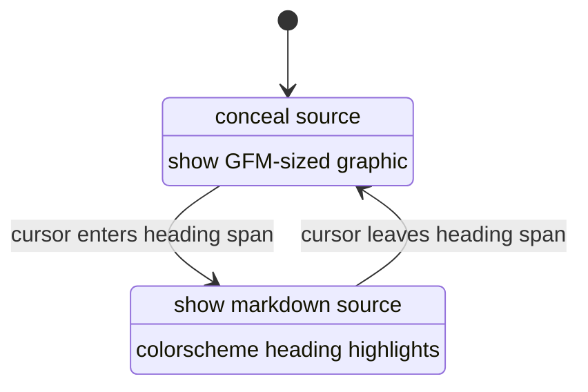

# Design: Heading graphics

| Created | Updated |
| --- | --- |
| 2026-09-11 | 2026-09-11 |

## Approach

Unfocused headings are media, not highlight chrome. The same Kitty +
`rsvg-convert` path used for math and images can draw real type sizes.
Focused headings stay source, with the colorscheme’s markdown highlighter.

## Analysis

Neovim extmarks cannot change font size. The current mapping (conceal `#`,
bold, h1/h2 virt-line rule) matches GFM **color and structure**, not
scale. That was an explicit v1 compromise
([gfm-inline-render design](./gfm-inline-render.md)).

GitHub `markdown.css`:

| Level | Size | Extra |
| --- | --- | --- |
| h1 | 2em | padding-bottom 0.3em; border-bottom |
| h2 | 1.5em | padding-bottom 0.3em; border-bottom |
| h3 | 1.25em | |
| h4 | 1em | |
| h5 | 0.875em | |
| h6 | 0.85em | muted foreground |

All levels are `font-weight: 600; line-height: 1.25`. Map `1em` to the
terminal cell height from the Kitty protocol metrics already used for math.

Alternatives considered:

| Method | Verdict |
| --- | --- |
| Keep conceal + bold | Rejected for this change; no size. |
| Kitty graphic of SVG text | **Chosen.** Known pipeline; librsvg/Pango draws system sans-serif. |
| MathJax / TeX for headings | Rejected. Wrong tool and slow. |
| Node canvas / Chromium | Rejected. No Chromium on this plugin’s media path. |

Lua can write the SVG (escape text, set `font-size` in px, optional
`border-bottom` rect). No new Node helper. `rsvg-convert -w` rasterizes;
cache key includes level, theme, text, and pixel-width bucket so resize
reuses or rebuilds like Mermaid.

Placement follows standalone images: graphic on the line above the heading,
`conceal_lines` on the source while unfocused. Setext is two source lines
(title + `===` / `---`); conceal both. First-line-of-buffer headings use
`virt_lines_above` on row 0.

On focus, skip `SuperMarkdownH*` so `@markup.heading` from the highlighter
is visible. Unfocused graphics use GFM tokens, not those groups.

Heading text for the SVG is the visible characters: ATX hashes and setext
underline stripped; inline markers stripped; link labels kept. Word-wrap at
the window content width in character columns, then size the SVG to that
pixel width.

`k` trapping is the same virt_lines + conceal_lines issue as images. Heading
source rows join `is_media_open`.

If `protocol.supported()` is false or `rsvg-convert` is missing, do not emit
a media job; keep today’s heading chrome.

## Decisions

- SVG in Lua + rsvg; no extra helper script.
- `1em` = cell height; GFM em scale from markdown.css.
- Transparent SVG background.
- Focused heading: source + colorscheme highlights, no plugin heading hl.
- Fallback to current chrome without graphics.

## Risks

- librsvg font fallback may not match GitHub’s system UI font. Accept
  “sans-serif at the right size” rather than matching a screenshot.
- A 2em heading occupies multiple cell rows; folds and `wrap` can still
  fight Kitty placeholders (same as images).
- Very long unwrapped CJK strings may overflow one SVG line; wrap on
  window columns, not only spaces.

## Visuals

The state diagram above is the interaction model. Sizes come from
GitHub markdown CSS, not a mock.

## Change history

| Date | Change |
| --- | --- |
| 2026-09-11 | Initial design |
