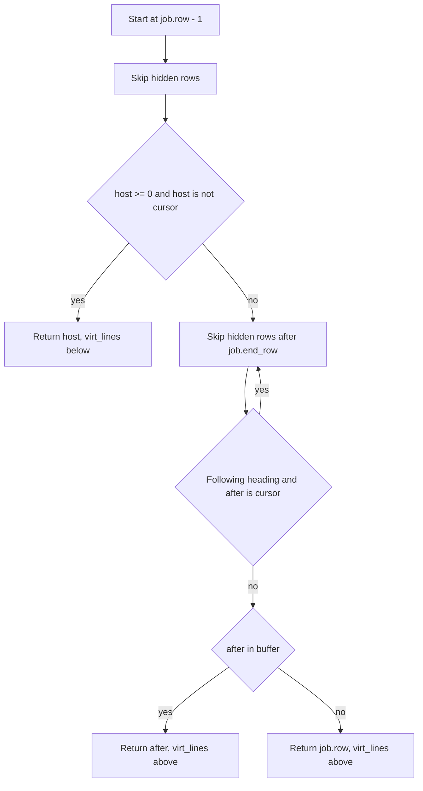
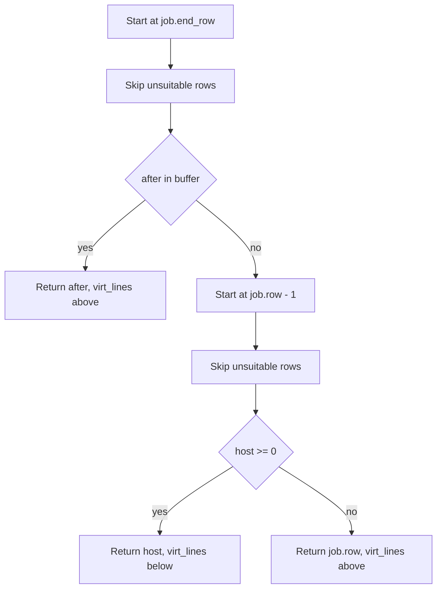
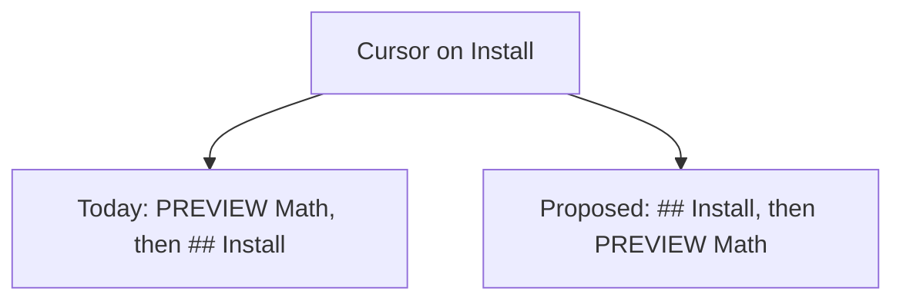

# Design: Stable heading virt_line hosts

| Created | Updated |
| --- | --- |
| 2026-09-14 | 2026-09-14 |

## Approach

Pick each heading graphic’s `virt_lines` host from the buffer and the
parse plan only. Do not walk “currently concealed” rows — that set
changes when the cursor enters a heading or a standalone image, which
is what moves neighbors today.

## Analysis

Kitty unicode placeholders live on the extmark’s host row. Herdr (and
similar compositors) find them by scanning cells, then emit absolute
`a=p` on the host. If the plugin moves a heading from “below row 4”
to “above row 7,” the placeholder grid is a different TUI rectangle
even when Neovim’s visual gap looks the same.

`heading_host` exists because `virt_lines` on a `conceal_lines` row do
not paint. Consecutive unfocused headings therefore skip each other
and share the nearest visible neighbor. `pack_virt` merges that stack
so Treesitter extmarks cannot reverse order (see
`tests/heading_order.lua`).

Three cursor predicates then **move** that shared host:

1. `hidden()` treats a focused heading/image/mermaid source as
   visible, so it becomes a legal host for neighbors.
2. `host ~= cursor_row` refuses `virt_lines` below the cursor
   (`<CR>` would land past the graphic) and flips to the after-host.
3. Following headings skip `after == cursor_row` so their graphic is
   not attached to the line being edited.

(1) and (3) are the “focus a heading, re-host neighbors” behavior.
(2) fires on ordinary `j`/`k` onto the paragraph above a heading:
below-previous and above-next occupy the **same visual gap** when
every line between them is concealed, but they are different extmark
rows.

`hidden` is cursor-dependent: a heading source is hidden only when
the cursor is outside its `block_range`.

### Same gap, two hosts

For an `intro` row, two concealed heading-source rows, then a `body`
row, `virt_lines` below `intro` and `virt_lines_above` on `body` both
paint in the intro–body gap. Cursor on `body` currently selects the
first host; cursor on `intro` selects the second. The screen matches,
but the placeholder rows do not.

### Consecutive focus vs screen order

`tests/heading_order.lua` requires, while editing one heading of a
gapless pair:

- the next preview stays **below** the source being edited
- the preceding preview stays **above** it
- the next graphic is not hosted **on** the edited line

Those three together force a cursor-dependent split of the stack.
Keeping them means neighbor hosts still move when focusing a heading
in that run — the expensive case (many heading bitmaps).

## Decisions

- **Prefer after / `virt_lines_above`.** That is already the first-line
  and “don’t attach to the edited line” path. It never puts
  `virt_lines` below the cursor, so the `<CR>` dodge can go. When the
  between-range is all heading sources, after/above is the same
  visual gap as before/below.
- **Unsuitable rows ignore focus.** Heading, image, and mermaid source
  rows are never hosts. Focusing them cannot steal a neighbor’s
  graphic onto the cursor line.
- **Relax preceding-above for gapless consecutive edits.** Unfocused
  order and “next preview below while editing the earlier heading”
  still hold (shared after-host is below the earlier source). While
  editing the later heading, the earlier graphic stays on that
  after-host and therefore appears below. Own-row hosting would keep
  both orders but collides with `conceal_lines` + `virt_lines`.
- **Do not change mermaid/image `block_host`.** Those already use a
  fixed previous line.

Unsuitable = `heading_source` / `image_source` / `mermaid_source` /
`mermaid_anchor` on that row in the plan, with no cursor test.

### Layout while editing the later heading

Today Math is re-hosted onto Install (`virt_lines_above`). Proposed
leaves Math on the run’s after-host. Leaving Install restores the
packed unfocused stack in both designs.

## Risks

- Brief wrong order while the cursor sits on a later heading in a
  gapless run. Reading (cursor in body) is unchanged.
- EOF with no suitable after or before still falls back to the source
  row (`conceal_lines` + `virt_lines`). Same as today; graphics may
  not paint. No new fallback without inserting buffer lines.
- `apply()` still `clear_namespace`s on every cursor move. Stable
  hosts stop the grid from **translating**; they do not cut the PTY
  dump. Incremental extmarks stay a separate change.

## Visuals

The flowcharts above are the host algorithm and the consecutive-edit
tradeoff. They are not a pixel layout to copy.

## Change history

| Date | Change |
| --- | --- |
| 2026-09-14 | Initial design |
| 2026-09-14 | Replaced the same-gap text sketch with prose |
| 2026-09-14 | Simplified the consecutive-edit comparison visual |
