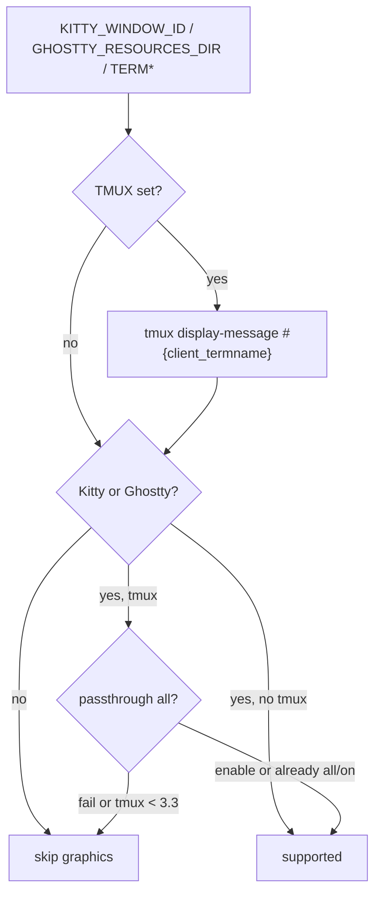

# Design: Add tmux support

| Created | Updated |
| --- | --- |
| 2026-09-16 | 2026-09-16 |

## Approach

Unicode placeholders already bind images to buffer cells, so tmux can
scroll and split them as text. The missing piece is delivering the Kitty
APC (`\e_G…\e\\`) to the outer terminal. Wrap that APC in tmux DCS
passthrough and enable it pane-locally.

## Analysis

`protocol.request` writes `\e_G…\e\\` with `nvim_ui_send`. Inside tmux,
stdout is the pane pty. tmux does not implement Kitty graphics and
discards the APC unless it is wrapped:

```
\ePtmux; <payload with every \e doubled> \e\\
```

Documented in the [tmux FAQ](https://github.com/tmux/tmux/wiki/FAQ#what-is-the-passthrough-escape-sequence-and-how-do-i-use-it).
As of tmux 3.3, `allow-passthrough` must be `on` or `all`. `on` only
forwards when the pane is visible; Neovim can transmit while the pane is
hidden, so use `all`.

snacks.image does the same wrap and runs
`tmux set -p allow-passthrough all`. image.nvim wraps the same way but
only *checks* the option. Pane-local auto-enable is the known-working
path: no tmux.conf, no persistent global change.

```mermaid
sequenceDiagram
  participant Nvim
  participant Tmux
  participant Term as Kitty or Ghostty
  Nvim->>Tmux: DCS tmux; doubled APC ST
  Tmux->>Term: APC graphics command
  Note over Nvim,Term: Placeholders are UTF-8 virt text, not APC
```

Placeholders (`U+10EEEE` plus diacritics) and highlight ids stay in the
buffer. They do not go through passthrough.

### Detection

Today `supported()` looks at `GHOSTTY_RESOURCES_DIR`, `KITTY_WINDOW_ID`,
`TERM_PROGRAM`, and `TERM`. Inside tmux `TERM` is `tmux-256color` and
`TERM_PROGRAM` is often `tmux`, but Kitty/Ghostty env vars are usually
still inherited — so `supported()` can already be true while APC is
dropped.



Do **not** probe XTVERSION (`\e[>q`). snacks needs that for a broader
terminal list; this plugin only supports Kitty and Ghostty. XTVERSION
plus tmux `extended-keys` also breaks Neovim `TermResponse`.
`#{client_termname}` is `xterm-kitty` / `xterm-ghostty` / `ghostty`.

### Cell size

`TIOCGWINSZ` inside tmux often reports `xpixel`/`ypixel` 0. Current
code then uses a 9×18 guess, which mis-sizes headings and media.

tmux 3.4+ exposes `#{client_cell_width}` and `#{client_cell_height}`
(present on 3.7c). Those are the outer terminal's cell pixels — the
same font the pane uses. Prefer ioctl when pixels are present; else
those formats; else 9×18, still unpinned so a later query can succeed.

### Alternatives

| Method | Verdict |
| --- | --- |
| DCS wrap + pane-local `allow-passthrough all` | **Chosen.** Documented by tmux; used by snacks.image. |
| Require tmux.conf only | Rejected. Easy to miss; health would warn forever. |
| XTVERSION to detect the outer terminal | Rejected. Fragile with tmux extended-keys; env + `client_termname` is enough. |
| Native tmux image protocol | Rejected. tmux still does not speak Kitty graphics. |
| Zellij / nested tmux | Out of scope. Nested sessions need one wrap per layer. |

## Decisions

- Wrap in `protocol.request` only. Callers stay unchanged.
- Enable passthrough pane-locally (`tmux set -p`), not globally.
- `supported()` is false inside tmux unless the outer terminal is
  Kitty/Ghostty **and** passthrough can be turned on.
- No new config keys.

## Risks

- Auto-enabling passthrough mutates the pane option. Mitigation:
  pane-local only; document it.
- Multi-client sessions with different fonts: `client_cell_*` is the
  querying client. Acceptable.
- Filename transmit (`t=f`) still requires the GUI terminal to read
  local paths. SSH remains out of scope.

## Change history

| Date | Change |
| --- | --- |
| 2026-09-16 | Initial design |
