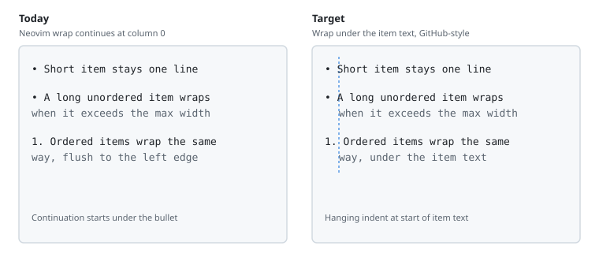

# Design: Wrap list items

| Created | Updated |
| --- | --- |
| 2026-09-17 | 2026-09-17 |

## Approach

Cap each list-item source line to `list.max_width`. If the line already
fits, leave it alone (existing bullet / checkbox chrome only). If it is
longer, reconstruct it like a table row: conceal the source, overlay the
first visual line, and grow downward with `virt_lines` (or overlays on
Neovim wrap continuations). Continuation lines use a hanging indent so
they align with the start of the item text after the marker.

## Analysis

Lists today only conceal an unordered marker to `•`. Ordered markers stay
as `1.`. Neovim `wrap` then continues at column 0, so a long item looks
like a new paragraph, not a GitHub list.

GitHub hanging indent is:

- Unordered: indent + bullet + space, then text. Wraps under the text.
- Ordered: indent + `N.` + space, then text. Wraps under the text
  (`10.` is wider than `1.`).
- Task: indent + checkbox glyph + remaining source space, then text.

The wrap budget is `max_width` display columns for the whole rendered
line (marker included). Item text wraps to
`max_width - hanging_indent`. Word boundaries match table cells
(`table.wrap_chunks`). One column of slack avoids virt_lines wrapping at
the window edge.

Tables already solved the Neovim-wrap collision: source wrap
continuations follow the window, not the feature cap; extra height uses
`virt_lines`. Lists should copy that placement so a wrapped item is not
stacked onto one visual line.

A full-line overlay hides buffer text, so inline chrome on that line
(emphasis, links, codespan, strike, emoji) must be rebuilt in the overlay
the same way table cells rebuild markdown. Cursor line hides overlay and
virt_lines (`hide_on_cursor`) so the source stays editable.

Inline images and other media jobs on a list line own their own virt
text. Overlaying that line would fight placement. Skip wrap on lines that
already have a media job.

Quote / alert chrome conceals `>` to a bar on the source line. Wrapped
continuations are new visual lines, so they should repeat the bar (and
quote highlight) at the left so the item still reads as inside the quote.

## Decisions

- Add `list.max_width` (default `1`, window content width). Same 0–1
  fraction / `>1` columns convention as tables.
- Operate per source line. A markdown continuation line of the same item
  wraps independently if it exceeds the cap; hanging indent aligns with
  that line’s first non-space character (already under the parent item
  text in normal GFM source).
- Reuse `table.wrap_chunks` (extract to a shared helper only if importing
  `table` from list wrap is awkward).
- Rendered prefix width (bullet / checkbox glyph, not source `- [x]`)
  defines hanging indent.
- `list.enabled = false` skips wrap and bullets. Task lines still wrap
  when `checkbox` is on even if the unordered marker is not replaced.
- Out of overlay wrap: lines with image / math media jobs.

## Risks

- Overlay + inline marks: must not double-apply emphasis on wrapped
  lines.
- Double-width checkbox glyphs can shift hanging indent versus `- [x]`.
- Quote bars on virt_lines must not steal width from the wrap budget
  twice.

## Visuals

Left is current Neovim wrap. Right is the target: short items unchanged,
long items wrap under the item text.

## Change history

| Date | Change |
| --- | --- |
| 2026-09-17 | Initial design |
