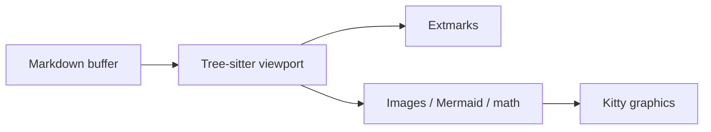
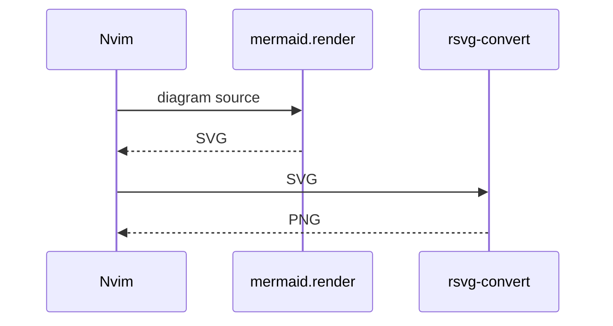

# super-markdown.nvim showcase

Open this file in Neovim with the plugin enabled. It exercises every in-buffer
feature. Compare the same tree in [gfm-hotview](https://github.com/keathmilligan/gfm-hotview)
if you want the browser-accurate page.

Emoji shortcodes: :rocket: :sparkles: :file_folder: :memo: :warning:

## Headings

Lorem ipsum dolor sit amet, consectetur adipiscing elit.

### Level 3

Sed do eiusmod tempor incididunt ut labore et dolore magna aliqua.

#### Level 4

Ut enim ad minim veniam, quis nostrud exercitation ullamco laboris.

##### Level 5

Duis aute irure dolor in reprehenderit in voluptate velit esse cillum.

###### Level 6 (muted)

Excepteur sint occaecat cupidatat non proident, sunt in culpa qui officia.

## Emphasis and text

**Bold**, *italic*, ***both***, and ~~strikethrough~~. Inline `code` uses a
monospace face. Autolink: https://github.com/keathmilligan/super-markdown.nvim

A footnote looks like this.[^sample]

## Lists

1. Ordered item
2. Nested:
   - Unordered
   - Another
3. Back to ordered

### Task list

- [x] Render GFM tables with formatted cells
- [x] Render task lists
- [ ] Ship the next feature

## Table with formatted cells

| Command | Purpose |
| --- | --- |
| `npm run dev` | Run the Vite client and assistant gateway together. |
| `npm run dev:client` | Run only the browser application on port 5173. |
| **bold** cell | ~~strike~~ and a [link](https://example.com) |

## Quote and rule

> A plain blockquote is not an alert.

---

## Alerts

> [!NOTE]
> Useful information that is not a warning.

> [!TIP]
> Relative image paths resolve from this file. PNG is passed through; SVG goes
> through `rsvg-convert`.

> [!IMPORTANT]
> Mermaid uses `mermaid.render()` only. There is no Chromium fallback.

> [!WARNING]
> Frontmatter stays in the buffer (dimmed). gfm-hotview strips it for HTML.

> [!CAUTION]
> Kitty graphics need Ghostty or Kitty. `:checkhealth super-markdown` reports it.

## Code

```lua
require('super-markdown').setup {
  media = { mermaid = true, math = true },
}
```

```bash
npm install --prefix scripts
```

## Math

Inline $E = mc^2$ and display. Backticks stay source: `$E = mc^2$`.

$$
x = \frac{-b \pm \sqrt{b^2 - 4ac}}{2a}
$$

## Images

PNG passthrough:


SVG via rsvg-convert:


## Mermaid





A reserved node id (`flowchart`) is a syntax error. The parse diagnostic stays until the source changes:

```mermaid
flowchart LR
  diagram[Diagram] --> flowchart[Flowchart]
```

[^sample]: Footnotes collect at the bottom of the page.
