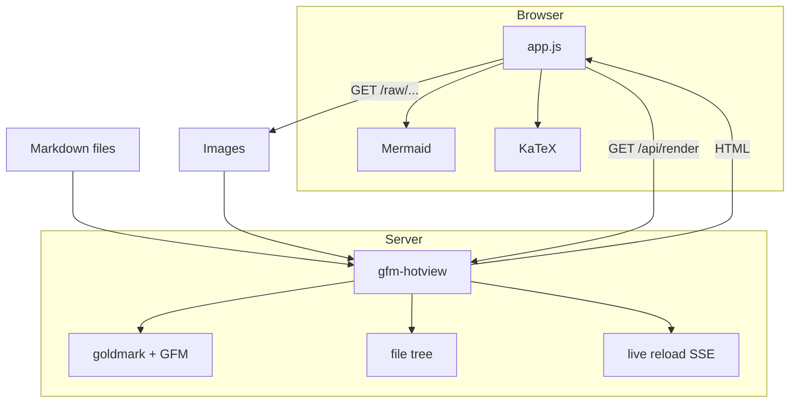
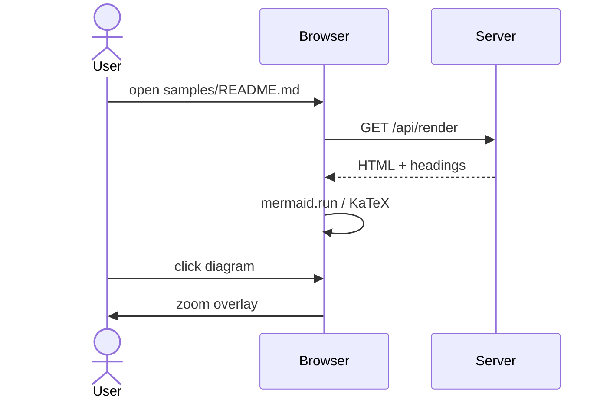
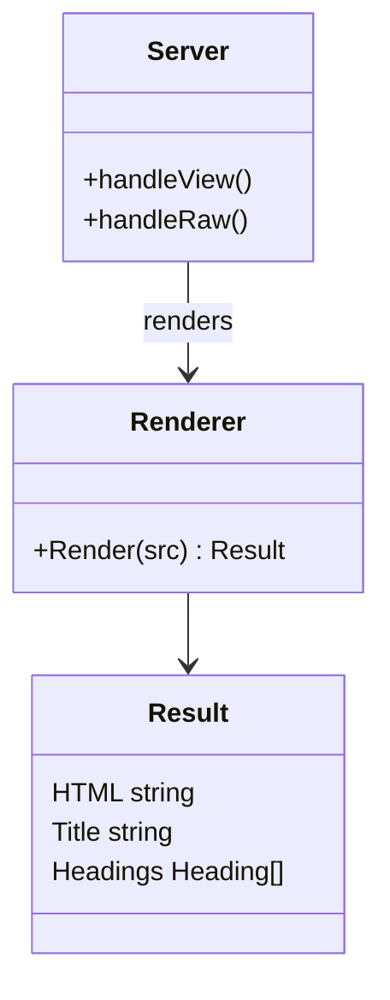
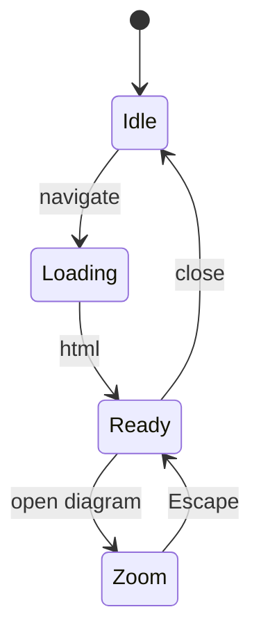
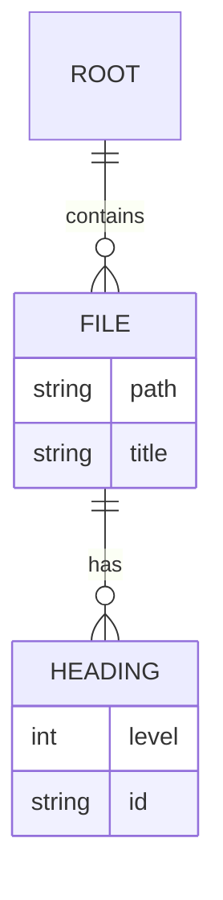
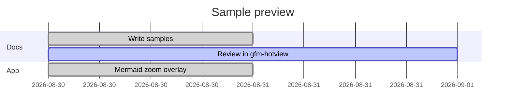
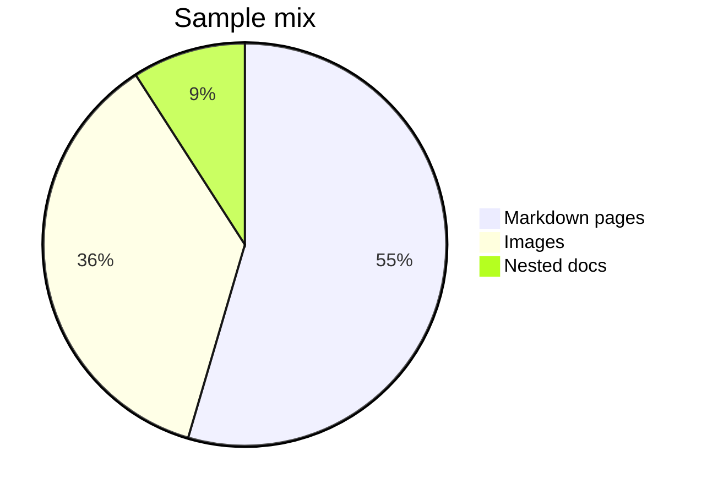

# Mermaid

Fenced ` ```mermaid ` blocks render in the browser. Click a diagram (or the
expand button) for a full-screen view: left-click drag to pan, mouse wheel to
zoom, Escape to close.

## Flowchart

A larger graph so zoom is useful.



## Sequence



## Class



## State



## Entity relationship



## Gantt



## Pie


